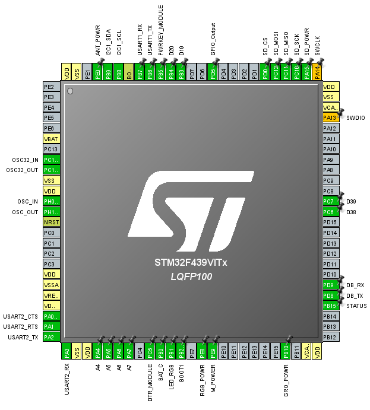
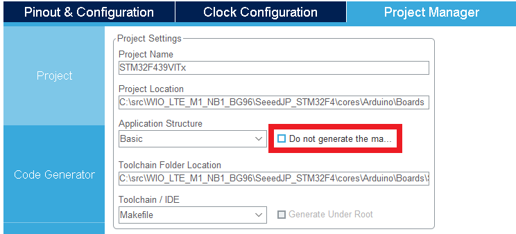
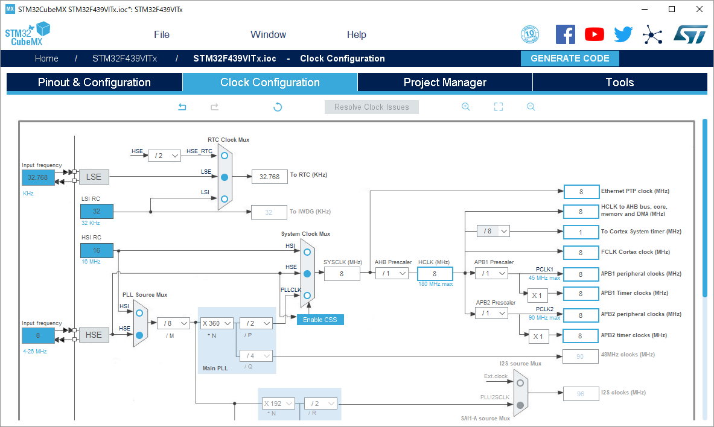
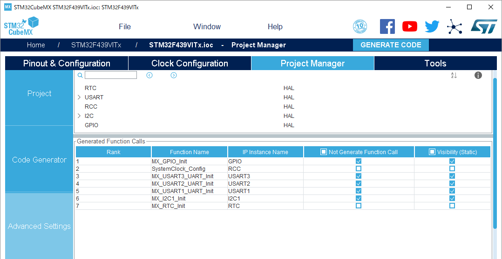

# Wio LTE M1/NB1(BG96) を STM32CubeMX から弄れるようにした

徒手空拳でHALを手懐けられない軟弱者なので作った。

# history

`../cores/Arduino/Boards/STM324x9I_EVAL` 消した。

`../cores/Arduino/STM32CubeF4/Drivers` 消した。

STM32CubeMXが出力したHALや初期化コードを `../cores/Arduino/Boards/STM32F439VITx` に置いた。

最新のHALになってしまった。

元のバージョンのSTM32CubeF4を手に入れる方法が分からないし、使われてないperipheral使いたいから仕方がない。

続いてSTM32CubeMXの設定をする。

----


Wio LTE M1/NB1(BG96) が使っているperipheralの定義を一応再現した。理由。利用されているHALをコピーしたいから。自由に使ってはならないピンをSTM32CubeMX上に表示したいから。

HAL全部コピーする設定で [GENERATE CODE] すれば前者は解決するので、ダミーのGPIO OUT設定でもいいのかもしれない。 

STM32CubeMXはこれらのperipheralの初期化コードも出力するが、Arduinoの世界で全てよしなにされているので、誤ってcallすると爆発する。

ADC, DACは入れてないのでArduinoライブラリからもマクロで切り落とした。理由。使わないから。

----

回路について。

ANT_POWR(PE0, 97) これ何処にも繋がってない気がする。別製品でのアクティブアンテナか否かの識別用…？

UARTなりADCはどれも標準のPinoutに沿ってるがTFカード端子だけはSDでもSPIでもない独自の定義になってる。不思議。

BAT_C(PB0, 35)でバッテリの接続状態が取れるかもしれない。

HSEは8MHz。標準では特に使ってないように思えるがLSEにも32.768KHzのクリスタル乗ってる、やったね、RTCで遊べるね。

----



main関数が毎回再生成されるとArduinoとして辻褄が合わなくなるので、[Do not generate the main] にチェックを入れて [GENERATE CODE] しないと爆発する。

代わりにユーザーコードとして次のmain関数を置いた。

```
/* USER CODE BEGIN 0 */
int main(void)
{
  HAL_Init();
  SystemClock_Config();
  setup();
  while (1)
  {
    loop();
  }
}
/* USER CODE END 0 */
```

あと [Do not generate the main] のチェックボックスは記憶されないので、STM32CubeMXを起動するたびにチェック入れないといけない。恰好悪い。

----

`stm32f4xx_hal_msp.c` を殺した。

MSP Initializationは明示的にcallしなくてもHALの中から呼ばれるので、Arduinoの世界と辻褄が合わなくなる。

恰好悪いが自分で追加したperipheralの初期化コードはここからコピペして適当なところに貼り付けて使う。

----

`stm32f4xx_it.c` のユーザーコードに元々の割り込みハンドラをコピペした。

これだけでそれらしく動くようになった。すごいね、元のを拵えた人達は優秀だね。

----

Clock Configurationの確認。



Lチカに毛が生えた程度のことしかしないんだから180MHzもいらないだろHSE直結の8MHzにしようぜ。動いた。

APB1, APB2のClockを8MHzより下げると各UARTの挙動がおかしくなった。よくわかってません。調べません。

Wio_cell_lib_for_Arduino側の話ではあるが、120MHz付近を境にWioSK6812のLED制御が壊れる。理由。タイミング決め打ちの実装だから。

雰囲気でWioSK6812.cppのDelayLoop変えると動いた。このLEDはちょっとした状況表示に便利なので後で真面目に考える。

----

RTCを追加する。VCAPもそれらしく回路があったし動く気がする。

STM32CubeMXからRTCを追加して [GENERATE CODE] する。

あと `SystemClock_Config` と 自分で追加したperipheralの初期化関数以外はstaticにした方が安心。



ハンドラはヘッダファイルのユーザーコードでexternして引き摺り出せるようにする。

動いた。激アツ。

```
#include "main.h"
#include <WioCellLibforArduino.h>

void setup() {
  MX_RTC_Init();
}

void loop() {
  delay(3000);
  RTC_DateTypeDef sdatestructureget;
  RTC_TimeTypeDef stimestructureget;

  HAL_RTC_GetTime(&hrtc, &stimestructureget, RTC_FORMAT_BIN);
  HAL_RTC_GetDate(&hrtc, &sdatestructureget, RTC_FORMAT_BIN);
}
```

----

なにもしてないのにGPIO動かないのは何故か。答え。何もしてないから。Arduinoの世界なら `Wio.PowerSupplyGrove(true);` する。

なにもしてないのにGPIOが動かないのは何故か。答え。何もしてないから。ポートにclockを流す。 `__HAL_RCC_GPIOB_CLK_ENABLE();` など。


----

考えなしにArduino_Core_STM32からRTC周りのコード持ってきた。LLも一緒に持ってきてるし、もっとまじめに考えた方がいい気がする。

https://github.com/stm32duino/Arduino_Core_STM32/tree/86f4f82231cee0f5bacdd9dfd7f58704b36a8d15

